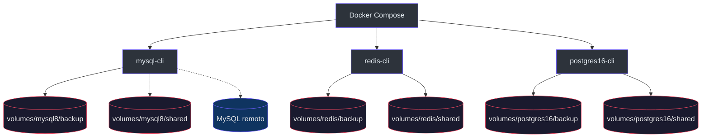

# db-utils

Utilitários locais para trabalhar com **MySQL**, **Redis** e **PostgreSQL** via contêineres CLI compartilhando volumes de backup e arquivos, orquestrados pelo Docker Compose (`docker-compose.yml:1-34`).

## Pré-requisitos

- [Docker](https://docs.docker.com/get-docker/) e Docker Compose v2
- Credenciais e rede de acesso aos bancos que você for consultar ou fazer dump (fora do escopo deste repositório)

## Mapa do repositório

| Caminho | Descrição |
|---------|-----------|
| `docker-compose.yml` | Serviços `mysql-cli`, `redis-cli`, `postgres16-cli` (`docker-compose.yml:1-34`) |
| `config/mysql/.env.exemple` | Variáveis de exemplo para dump/restore MySQL (`config/mysql/.env.exemple:1-14`) |
| `docker/mysql/scripts/mysql-dump-on-start.sh` | Script de mysqldump ao subir o contêiner MySQL (`docker/mysql/scripts/mysql-dump-on-start.sh:1-96`) |
| `docs/` | Cheatsheets SQL e exemplos de linha de comando |
| `volumes/` | Dados montados nos contêineres — ignorados pelo Git (`.gitignore:1`) |

Os diretórios `scripts/` e `volumes/*` estão no `.gitignore` (`.gitignore:1-5`); ajuste localmente sem versionar segredos.

## Visão geral



## Primeiros passos

1. **Configurar variáveis de ambiente**

   - **MySQL:** copie `config/mysql/.env.exemple` para `config/mysql/.env` e preencha host, usuário, senha e porta (`config/mysql/.env.exemple:3-14`). O serviço `mysql-cli` carrega `./config/mysql/.env` (`docker-compose.yml:7-8`).
   - **Redis e PostgreSQL:** o compose referencia `./config/redis/.env.exemple` e `./config/postgres/.env.exemple` (`docker-compose.yml:19-20`, `docker-compose.yml:29-30`). Crie esses arquivos (ou ajuste o `docker-compose.yml`) conforme seu ambiente.

2. **Subir um contêiner CLI**

   ```bash
   docker compose up -d mysql-cli
   ```

3. **Executar comandos dentro do contêiner**

   ```bash
   docker compose exec mysql-cli mysql -h"$DUMP_MYSQL_HOST" -u"$DUMP_MYSQL_USER" -p
   ```

Volumes úteis: backups em `volumes/mysql8/backup`, `volumes/redis/backup`, `volumes/postgres16/backup` e compartilhamento de arquivos em `.../shared` (`docker-compose.yml:10-12`, `docker-compose.yml:21-23`, `docker-compose.yml:31-32`).

## Serviços (resumo)

| Serviço | Imagem | `env_file` principal |
|---------|--------|------------------------|
| `mysql-cli` | `mysql:8.0` | `./config/mysql/.env` (`docker-compose.yml:2-12`) |
| `redis-cli` | `redis` | `./config/redis/.env.exemple` (`docker-compose.yml:14-23`) |
| `postgres16-cli` | `postgres:16` | `./config/postgres/.env.exemple` (`docker-compose.yml:24-33`) |

O comando padrão dos três é `/bin/bash` (`docker-compose.yml:6`, `docker-compose.yml:17`, `docker-compose.yml:27`).

## Dump automático MySQL (`mysql-dump-on-start.sh`)

O script é montado em `/scripts/mysql-dump-on-start.sh` no serviço `mysql-cli` (`docker-compose.yml:9-10`). Comportamento documentado no próprio arquivo:

- Se `DUMP_MYSQL_HOST` estiver vazio, o dump automático é ignorado (`docker/mysql/scripts/mysql-dump-on-start.sh:60-63`).
- Caso contrário, aguarda o servidor com `mysqladmin ping` e gera `--all-databases` em `DUMP_MYSQL_OUTPUT` ou em `/backup/all-databases.sql` por padrão (`docker/mysql/scripts/mysql-dump-on-start.sh:14-54`).
- `DUMP_RUN_IN_BACKGROUND=1` executa o mysqldump em background (`docker/mysql/scripts/mysql-dump-on-start.sh:66-69`).
- Argumento `manual` força apenas o dump (`docker/mysql/scripts/mysql-dump-on-start.sh:83-92`).

Variáveis esperadas estão alinhadas ao exemplo em `config/mysql/.env.exemple:3-8`.

## Documentação em `docs/`

| Arquivo | Conteúdo |
|---------|-----------|
| `docs/mysql.md` | Parâmetro `lower_case_table_names`, tamanho do BD, processlist e locks (`docs/mysql.md:7-46`) |
| `docs/postgres.md` | Tamanho do BD, `pg_stat_activity`, encerramento de sessão (`docs/postgres.md:7-31`) |
| `docs/mysqldump.md` | Exemplo de `mysqldump` por banco com opções recomendadas (`docs/mysqldump.md:7-28`) |
| `docs/psql-restore.md` | Exemplo de restore com `psql` e variáveis de ambiente (`docs/psql-restore.md:7-13`) |

## Solução de problemas

- **Compose falha ao subir por `env_file` ausente:** crie os arquivos referenciados em `docker-compose.yml` ou aponte `env_file` para caminhos existentes.
- **Dump MySQL não roda:** confira `DUMP_MYSQL_HOST`, `DUMP_MYSQL_USER` e `DUMP_MYSQL_PASSWORD` (`docker/mysql/scripts/mysql-dump-on-start.sh:10-11`).
- **Timeout ao conectar:** aumente `DUMP_WAIT_MAX_SECONDS` (usado em `docker/mysql/scripts/mysql-dump-on-start.sh:15`, `docker/mysql/scripts/mysql-dump-on-start.sh:21-29`).

## Glossário

- **CLI container:** contêiner com cliente de banco e shell, sem servidor de banco embutido para uso como serviço de dados.
- **Dump:** exportação SQL (mysqldump); detalhes de flags em `docs/mysqldump.md:7-28`.
